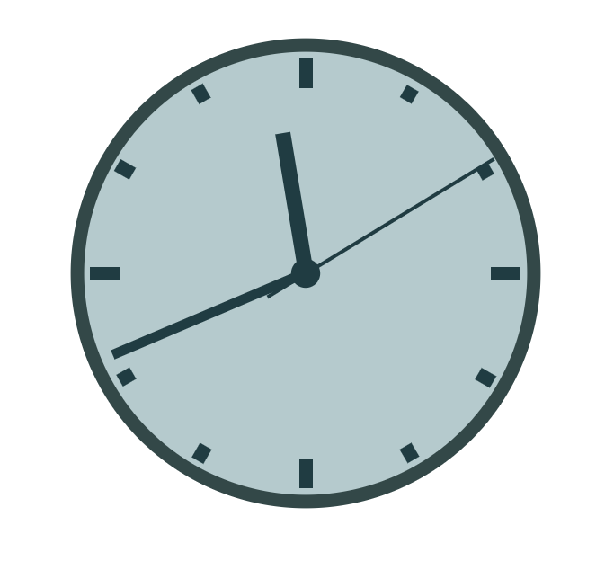

# Digital-Analog-Clock
A digital analog clock using HTML, CSS, JS

This digital analog clock was created and adapted by following the Java Script Essentials trainig course via LinkedIn Learning (https://www.linkedin.com/learning/javascript-essential-training-3/). 

